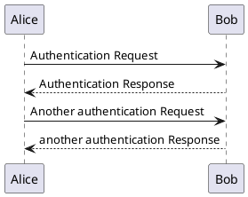

# Markdown Sample

> Welcome to use Markdown 🎉

[GitHub](http://github.com)


Format: 

Sometimes you want numbered lists:

1. One
2. Two
3. Three

@someone Hello there.

## Sometimes you want bullet points:

* Start a line with a star
* Profit!

**Alternatively,**

- Dashes work just as well
  - The indent first
    - The indent second
      - The indent third
- And if you have sub points, put two spaces before the dash or star:
  - Like this
  - And this

```rb
class BlueDoc
  class << self
    def markdown
      BlueDoc::HTML.render("Hello **world**")
    end
  end
end
```

## PlantUML



## Image


### Test HTML chars

The `<>`, `><`, `>` and `<` will keep, but <b>will</b> will render as html.

### 全是中文

这行包含中文 English 混排的例子，此方式已在 Ruby China 使用多年，支持 HTML 处理，于 3 月 10 日开始。

## Tables

First Header | Second Header
------------ | -------------
Content from cell 1 | Content from cell 2
Content in the first column | Content in the second column
